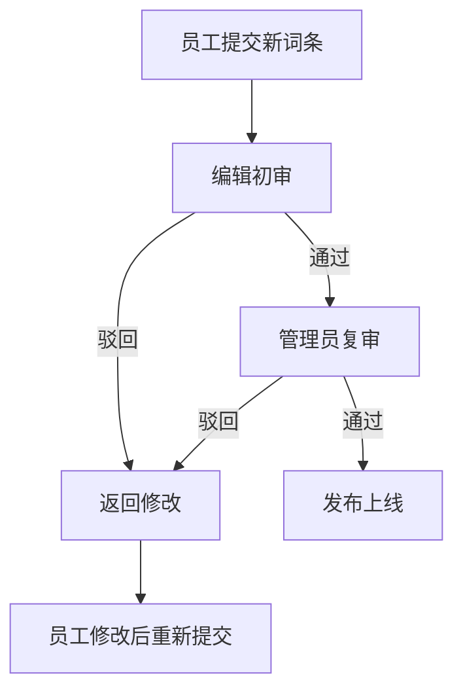
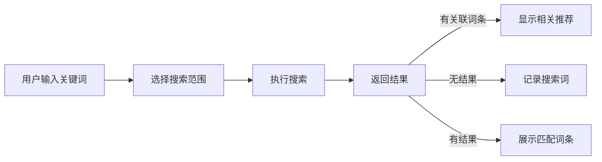

# 公司知识百科 Web 应用 - 产品需求文档

## 1. 产品概述

一个企业内部知识管理系统,为企业员工提供制度、流程和项目经验的快速查找平台。系统支持多维度检索、版本管理、协作编辑和审核流程,帮助企业沉淀知识资产,提升组织效率。

**目标用户:**
- 普通员工: 查找和使用知识内容
- 知识编辑: 内容的创建、维护和审核
- 系统管理员: 系统配置和数据分析

## 2. 核心功能模块

### 2.1 用户角色

| 角色 | 注册方式 | 核心权限 |
|------|----------|----------|
| 员工 | 企业邮箱自动创建 | 浏览、搜索、评论、收藏、提交新词条 |
| 编辑 | 管理员指定 | 审核词条、合并重复、设置范围、发起提醒 |
| 管理员 | 超级权限 | 配置分类、置顶公告、数据分析、用户管理 |

### 2.2 功能模块

#### 2.2.1 首页推荐
- **公告栏**: 置顶重要通知和最新制度
- **热门词条**: 高访问量和高收藏量的精选内容
- **最新更新**: 最近编辑或新增的词条列表
- **分类速查**: 主要分类的快速入口
- **搜索栏**: 支持关键词、部门、标签的组合搜索

#### 2.2.2 词条详情
- **内容展示**: 富文本格式,支持图片、表格、附件
- **版本管理**: 权威版本标记、历史版本对比
- **相关信息**: 相关词条推荐、相关附件下载
- **互动区域**: 评论提问、补充案例、收藏分享

#### 2.2.3 分类目录
- **树形结构**: 部门分类和知识类型分类
- **标签系统**: 灵活的内容标记
- **筛选排序**: 按部门、时间、热度筛选

#### 2.2.4 编辑工作台
- **词条编辑**: 富文本编辑器,支持版本对比
- **重复检测**: 智能识别相似词条,支持合并
- **适用范围**: 设置词条的可见范围(全员/部门/角色)
- **过期提醒**: 设置定期审核提醒,保持内容时效性
- **附件管理**: 上传和管理相关文档

#### 2.2.5 审核中心
- **待审核列表**: 展示所有待审核的词条变更
- **审核流程**: 初审、复审的流程管理
- **审核历史**: 记录所有审核操作和意见
- **批量操作**: 批量审核、批量驳回

#### 2.2.6 管理后台
- **分类配置**: 管理知识分类体系
- **公告管理**: 发布和置顶系统公告
- **数据分析**: 热门搜索、无结果搜索、访问统计
- **用户管理**: 角色分配和权限管理

## 3. 核心流程

### 3.1 词条创建流程

### 3.2 搜索查询流程

## 4. 用户界面设计

### 4.1 设计风格

**整体风格:** 现代专业主义,融合知识管理的严谨性与互联网产品的易用性

**色彩方案:**
- **主色**: #1E40AF (深蓝) - 专业、信任、权威
- **辅色**: #0891B2 (青色) - 活力、知识、成长
- **强调色**: #F59E0B (琥珀) - 重要标记、警示
- **成功色**: #10B981 (翠绿) - 通过、成功状态
- **背景色**: #F8FAFC (浅灰白) - 干净、舒适
- **文字色**: #1E293B (深灰) - 易读、专业

**字体选择:**
- **标题字体**: "Noto Sans SC", "PingFang SC", sans-serif
- **正文字体**: "Inter", "Noto Sans SC", sans-serif
- **等宽字体**: "JetBrains Mono", monospace (代码片段)

**按钮风格:** 圆角按钮 (border-radius: 8px), 悬停微阴影效果

**布局风格:** 响应式卡片布局,顶部导航 + 侧边栏组合

**图标风格:** Lucide Icons (线性图标,简洁现代)

### 4.2 页面设计概览

#### 首页
| 模块 | 设计特点 |
|------|----------|
| 顶部导航 | 固定顶部,毛玻璃效果背景, Logo + 搜索 + 用户信息 |
| 公告轮播 | 全宽卡片,重要公告自动轮播,琥珀色边框强调 |
| 热门词条 | 三列卡片网格,图标+标题+摘要,悬停上浮效果 |
| 分类入口 | 图标按钮组,部门+类型双维度,悬停变色 |
| 底部 | 版权信息、快速链接、版本号 |

#### 词条详情页
| 模块 | 设计特点 |
|------|----------|
| 面包屑导航 | 分类路径导航,点击可跳转 |
| 词条头部 | 大标题、版本标签、部门标签、收藏按钮 |
| 内容区域 | 响应式布局,左侧正文+右侧目录导航 |
| 附件区域 | 文件列表卡片,图标区分类型,点击下载 |
| 评论区 | 卡片式评论,头像+时间+内容,支持回复 |
| 相关推荐 | 横向滚动卡片,标签匹配度排序 |

#### 分类目录页
| 模块 | 设计特点 |
|------|----------|
| 左侧树形菜单 | 可折叠部门树,图标+名称,选中高亮 |
| 右侧内容区 | 网格/列表切换,排序和筛选工具栏 |
| 标签云 | 标签气泡组,大小表示数量,点击筛选 |

#### 编辑工作台
| 模块 | 设计特点 |
|------|----------|
| 编辑器 | 全宽富文本编辑器,工具栏固定顶部 |
| 辅助面板 | 右侧滑出面板: 版本对比、元数据设置 |
| 保存控制 | 草稿/提交审核按钮,自动保存指示 |

#### 审核中心
| 模块 | 设计特点 |
|------|----------|
| 待审核列表 | 表格式布局,状态标签,快速操作按钮 |
| 审核详情 | 左右对比: 原始版本 vs 修改版本 |
| 审核操作 | 通过/驳回按钮,填写意见输入框 |

### 4.3 响应式设计

- **桌面端 (≥1200px)**: 完整三栏布局,侧边导航展开
- **平板端 (768px-1199px)**: 两栏布局,侧边栏可折叠
- **移动端 (<768px)**: 单栏布局,底部标签导航,汉堡菜单

### 4.4 交互细节

- **页面加载**: 骨架屏动画,内容渐入效果 (stagger animation)
- **搜索**: 实时搜索建议下拉,按回车执行搜索
- **收藏**: 心形图标点击动画,数字跳动效果
- **评论**: 新评论滑入效果,回复嵌套缩进
- **标签**: 标签胶囊悬停放大,点击添加选中状态
- **卡片悬停**: 上浮 + 阴影加深效果
- **按钮点击**: 缩放 + 颜色加深反馈

## 5. 技术实现优先级

### 5.1 第一阶段 (MVP)
- 首页展示和导航
- 词条列表和详情查看
- 基础搜索功能
- 用户登录状态管理

### 5.2 第二阶段
- 词条创建和编辑
- 评论和收藏功能
- 分类目录管理
- 审核流程

### 5.3 第三阶段
- 管理后台功能
- 数据分析统计
- 高级搜索筛选
- 消息通知系统
