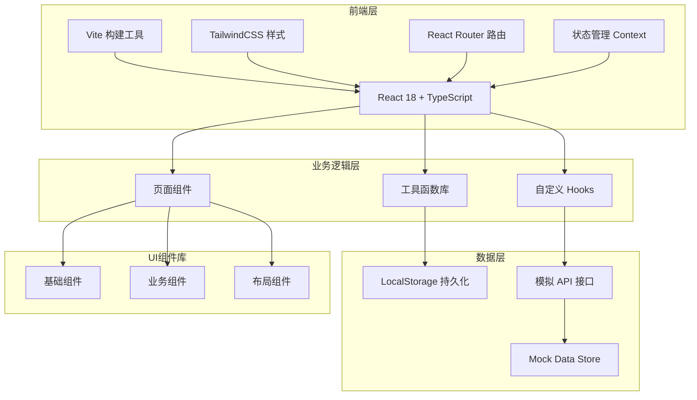

# 公司知识百科 Web 应用 - 技术架构文档

## 1. 架构设计

### 1.1 系统架构图



## 2. 技术栈说明

### 2.1 前端框架
- **React 18**: 核心框架,使用函数组件和Hooks
- **TypeScript**: 类型安全,提高代码质量
- **Vite**: 现代化构建工具,快速热更新

### 2.2 样式方案
- **TailwindCSS 3**: 原子化CSS框架,快速构建响应式界面
- **CSS Variables**: 主题色彩和设计令牌管理

### 2.3 路由管理
- **React Router v6**: 客户端路由,支持嵌套路由和懒加载

### 2.4 状态管理
- **React Context**: 全局状态管理(用户信息、收藏列表)
- **组件状态**: useState/useReducer 管理局部状态
- **LocalStorage**: 持久化用户偏好设置

### 2.5 数据层
- **Mock Data**: 模拟真实数据结构
- **localStorage**: 本地数据持久化
- **Custom Hooks**: 封装数据获取逻辑

## 3. 路由定义

| 路由 | 组件 | 功能说明 | 权限 |
|------|------|----------|------|
| `/` | HomePage | 首页推荐 | 公开 |
| `/entry/:id` | EntryDetailPage | 词条详情 | 公开 |
| `/category` | CategoryPage | 分类目录 | 公开 |
| `/category/:id` | CategoryPage | 分类词条列表 | 公开 |
| `/search` | SearchPage | 搜索结果 | 公开 |
| `/editor` | EditorPage | 编辑工作台 | 编辑+ |
| `/editor/:id` | EditorPage | 编辑已有词条 | 编辑+ |
| `/review` | ReviewPage | 审核中心 | 管理员 |
| `/admin` | AdminPage | 管理后台 | 管理员 |
| `/profile` | ProfilePage | 个人中心 | 已登录 |

## 4. 数据模型

### 4.1 核心实体

#### 4.1.1 词条 (Entry)
```typescript
interface Entry {
  id: string;
  title: string;
  content: string;
  summary: string;
  categoryId: string;
  departmentId: string;
  tags: string[];
  authorId: string;
  authorName: string;
  createdAt: string;
  updatedAt: string;
  version: number;
  isOfficial: boolean;
  scope: 'all' | 'department' | 'role';
  scopeValue?: string;
  attachments: Attachment[];
  status: 'draft' | 'pending' | 'approved' | 'rejected';
  viewCount: number;
  favoriteCount: number;
  commentCount: number;
}
```

#### 4.1.2 分类 (Category)
```typescript
interface Category {
  id: string;
  name: string;
  parentId?: string;
  icon: string;
  description: string;
  entryCount: number;
  sortOrder: number;
}
```

#### 4.1.3 部门 (Department)
```typescript
interface Department {
  id: string;
  name: string;
  parentId?: string;
  manager: string;
  entryCount: number;
}
```

#### 4.1.4 用户 (User)
```typescript
interface User {
  id: string;
  name: string;
  email: string;
  avatar: string;
  role: 'employee' | 'editor' | 'admin';
  departmentId: string;
  favoriteEntries: string[];
  createdAt: string;
}
```

#### 4.1.5 评论 (Comment)
```typescript
interface Comment {
  id: string;
  entryId: string;
  userId: string;
  userName: string;
  userAvatar: string;
  content: string;
  parentId?: string;
  createdAt: string;
  likeCount: number;
}
```

#### 4.1.6 附件 (Attachment)
```typescript
interface Attachment {
  id: string;
  name: string;
  url: string;
  size: number;
  type: string;
  uploadedAt: string;
}
```

#### 4.1.7 公告 (Announcement)
```typescript
interface Announcement {
  id: string;
  title: string;
  content: string;
  priority: 'normal' | 'high' | 'urgent';
  isPinned: boolean;
  createdAt: string;
  authorId: string;
}
```

#### 4.1.8 历史版本 (Version)
```typescript
interface Version {
  id: string;
  entryId: string;
  version: number;
  content: string;
  authorId: string;
  authorName: string;
  createdAt: string;
  changeNote: string;
}
```

#### 4.1.9 审核记录 (Review)
```typescript
interface Review {
  id: string;
  entryId: string;
  reviewerId: string;
  reviewerName: string;
  action: 'approve' | 'reject';
  comment: string;
  createdAt: string;
}
```

## 5. 组件结构

### 5.1 布局组件 (Layout)
- `Header`: 顶部导航栏
- `Sidebar`: 侧边栏导航
- `Footer`: 底部信息栏
- `Layout`: 主布局容器

### 5.2 基础组件 (Base)
- `Button`: 按钮组件
- `Input`: 输入框组件
- `Card`: 卡片组件
- `Modal`: 模态框
- `Tag`: 标签组件
- `Avatar`: 用户头像
- `Badge`: 徽章组件
- `Dropdown`: 下拉菜单
- `Tabs`: 标签页
- `Breadcrumb`: 面包屑导航

### 5.3 业务组件 (Business)
- `EntryCard`: 词条卡片
- `EntryList`: 词条列表
- `SearchBar`: 搜索栏
- `CategoryTree`: 分类树
- `CommentSection`: 评论区域
- `VersionTimeline`: 版本时间线
- `AnnouncementBanner`: 公告横幅
- `HotEntries`: 热门词条组件
- `RecentUpdates`: 最新更新组件

## 6. Mock 数据结构

### 6.1 数据文件
```
src/data/
├── mockEntries.ts      # 词条数据
├── mockCategories.ts   # 分类数据
├── mockDepartments.ts  # 部门数据
├── mockUsers.ts        # 用户数据
├── mockComments.ts     # 评论数据
└── mockAnnouncements.ts # 公告数据
```

### 6.2 数据初始化
- 系统启动时加载初始Mock数据
- 用户操作数据存储到LocalStorage
- 页面刷新时从LocalStorage恢复数据

## 7. 目录结构

```
knowledge-base/
├── public/
│   └── favicon.ico
├── src/
│   ├── assets/              # 静态资源
│   │   └── images/          # 图片资源
│   ├── components/          # 组件目录
│   │   ├── base/           # 基础组件
│   │   ├── business/        # 业务组件
│   │   └── layout/          # 布局组件
│   ├── pages/              # 页面组件
│   │   ├── HomePage.tsx
│   │   ├── EntryDetailPage.tsx
│   │   ├── CategoryPage.tsx
│   │   ├── SearchPage.tsx
│   │   ├── EditorPage.tsx
│   │   ├── ReviewPage.tsx
│   │   ├── AdminPage.tsx
│   │   └── ProfilePage.tsx
│   ├── hooks/              # 自定义Hooks
│   │   ├── useEntries.ts
│   │   ├── useSearch.ts
│   │   ├── useUser.ts
│   │   └── useLocalStorage.ts
│   ├── context/            # React Context
│   │   ├── UserContext.tsx
│   │   └── ThemeContext.tsx
│   ├── data/               # Mock数据
│   │   └── mock*.ts
│   ├── utils/              # 工具函数
│   │   ├── formatDate.ts
│   │   ├── debounce.ts
│   │   └── storage.ts
│   ├── types/              # TypeScript类型
│   │   └── index.ts
│   ├── styles/             # 全局样式
│   │   └── index.css
│   ├── App.tsx             # 根组件
│   └── main.tsx            # 入口文件
├── index.html
├── package.json
├── tsconfig.json
├── vite.config.ts
├── tailwind.config.js
└── postcss.config.js
```

## 8. 性能优化策略

### 8.1 代码分割
- 使用 React.lazy 进行路由懒加载
- 组件按需加载,减少首屏加载时间

### 8.2 渲染优化
- 使用 React.memo 缓存组件
- 合理使用 useMemo 和 useCallback
- 虚拟列表优化长列表渲染

### 8.3 资源优化
- 图片懒加载
- CSS和JS代码压缩
- Tree-shaking 移除未使用代码

### 8.4 缓存策略
- LocalStorage 缓存用户数据
- 避免重复请求相同数据

## 9. 浏览器兼容性

- Chrome 90+
- Firefox 88+
- Safari 14+
- Edge 90+

## 10. 开发规范

### 10.1 命名规范
- 组件名: PascalCase (如: EntryCard)
- 函数名: camelCase (如: useEntries)
- 常量: UPPER_SNAKE_CASE
- CSS类名: kebab-case

### 10.2 代码风格
- 使用 ESLint + Prettier 统一代码风格
- 遵循 React Hooks 规范
- TypeScript 严格模式

### 10.3 Git提交规范
```
feat: 新功能
fix: 修复bug
docs: 文档更新
style: 代码格式
refactor: 重构
test: 测试
chore: 构建/工具
```
